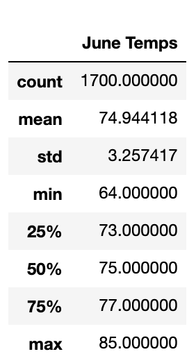
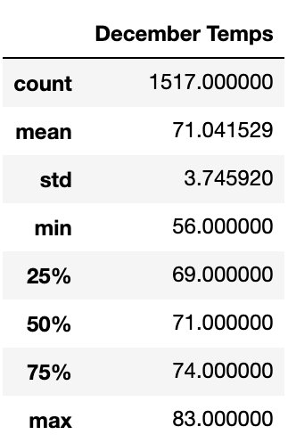

# surfs_up

## Overview
The purpose of this analysis was to analyze temperature trends for the months of June through December in Oahu, Hawaii to determine how best to optimize the surf and ice cream shop businesses thoughout the year. By extracting temperature information during these periods for this location, we can analyze to determine if there are any important trends that could impact the business decisions of these shops. 

## Results
The results of the analysis determined that the temperature data during June, typically considered a peak month of summer, was relatively close to the temperature data of December, the start of the winter. June also had nearly 200 more temperature data recorded because the extracted June data was for the Years 2010 through 2017 while the December data was only from 2010 through 2016. However, there were some other key results of note:

- The average/mean temperature for June was 75 degrees while the mean temperature for December was 71 degrees, a relatively minimal difference. 

- The maximum temperatures were 85 degrees and 83 degrees for June and December, respectively. This is a remarkably low difference.

- The minimum temperatures were 64 degrees and 56 degrees for June and December, respectively. This shows a greater separation and variance for December, which is logical since December generally marks the start of winter, where temperatures are more prone to declining.

See below for a visual summary breakdown for each month:

           

## Summary
Based on looking at both datasets, it appears that the surf and ice cream businesses would both definitely have sustainable business between June and December. December seems to have a wider range of temperatures, while June's temperatures are closer and more consistent. Despite this, the average temperature only appears to have a 4 degree difference and it is still in the range of being warm enough weather (70 degrees) that is comfortable enough for people to go surf and indulge on cold sweet treats. This is something the surf shop and ice cream shop in Oahu will want to capitalize on. 

Additional queries can be run to determine whether the surf shop and ice cream shop can truly be sustainable year round. Despite Hawaii always having a reputation for its appealing weather and temperatures, one such query would be to analyze data from the months of January through March (and might as well also analyze April), the period traditionally known for the coldest winter months and typically applies across the nation in the US. It would be best to filter and analyze by each month. This could determine when the temperatures are at their lowest and whether they are still in warm enough temperature ranges to justify keeping the businesses open during that time. 

Another query that can be run is to extract the precipitation data. This could be vital information in determine which months experience the most precipitation, which would be periods of time that would deter people from wanting to go out to surf and enjoy ice cream. Just because a certain time frame or month experiences higher temperatures, it does not necessarily mean that the days are free from rain. For this particular query, extracting the precipation data per month would be most ideal to compare and contrast the precipitation levels from June through December. This query can also be expanded to extract and analyze precipitation data for the rest of the months as well to truly determine the most/least optimal times for business. It would also be important toanalyze the results of both of these additional queries based on weather stations.The closest weather station will provide the most accurate and reliable information.

Lastly, it would be helpful to plot both the preceipation and temperature data on a histogram. This can be easier to visualize to determine any trends and at which specific points of each month are the most/least optimal for business. Perhaps the shops can strategically partially close for certain days/periods if the data shows enough patterns for the business operators to safely determine it would or would not be worth it to open up the shop for business during that particular time frame.
